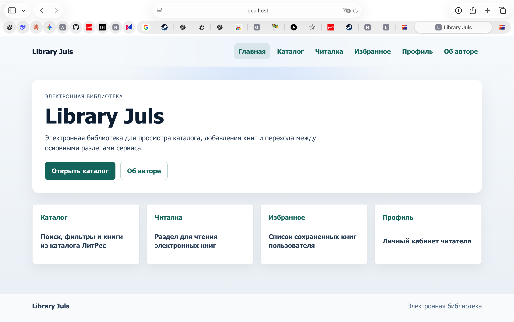
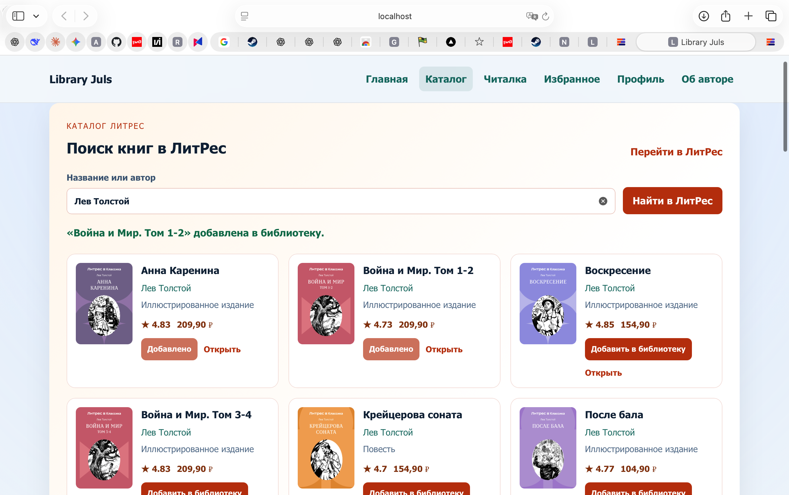

# Library Juls

SPA-приложение электронной библиотеки на Vue 3 с серверной частью на FastAPI.

**Авторы:** Рыбаков Я.В., Смирнова Ю.Е.  
**Группа:** P3269 
**Репозиторий:** <https://github.com/pistaha/libraryJuls-2>

## Цель работы

Разработать учебный прототип электронной библиотеки: клиентскую часть на Vue 3, серверную часть на Python, REST API для работы с книгами, маршрутизацию, формы, компоненты и запуск через Docker.

## Реализованный функционал

- главная страница с переходом в электронный каталог;
- список книг с выводом через `v-for`;
- фильтрация по категории, наличию, избранному и брони;
- сортировка по дате добавления и по названию;
- условный рендеринг загрузки, ошибки и пустого списка;
- создание книги через отдельную страницу `/books/new`;
- редактирование книги через `/books/:id/edit`;
- удаление книги из каталога;
- изменение статуса наличия;
- добавление книги в избранное;
- бронирование книги;
- поиск книг в ЛитРес через backend-прокси;
- импорт найденной книги из ЛитРес в локальный каталог;
- страница 404 с отдельным оформлением;
- Docker-запуск frontend и backend.

## Vue 3

В проекте используются базовые возможности Vue 3:

- `v-model.trim` и `v-model.number` в форме книги;
- `v-if`, `v-else-if`, `v-else` для состояний списка;
- `v-for` для вывода книг и вариантов формы;
- `computed` для фильтрации, сортировки и списка категорий;
- `watch` для реакции на изменение фильтров;
- `props` в компонентах `BookItem`, `BookList`, `BookForm`, `LayoutCard`;
- события дочерних компонентов: удаление, изменение статуса, избранное, бронь;
- жизненный цикл `onMounted` для загрузки данных с сервера.

## Компоненты

| Компонент | Назначение |
| --- | --- |
| `AppHeader.vue` | верхнее меню приложения |
| `AppFooter.vue` | нижняя панель |
| `BookList.vue` | список книг, фильтрация и сортировка |
| `BookItem.vue` | карточка одной книги |
| `BookForm.vue` | форма создания и редактирования |
| `LayoutCard.vue` | общий компонент-обертка со слотами |
| `LitresSearch.vue` | поиск книг в каталоге ЛитРес |

## Слоты

Слоты используются в компоненте `LayoutCard.vue`:

- обычный слот для основного содержимого;
- именованный слот `actions` для кнопок в шапке карточки;
- именованный scoped-slot `meta`, который получает данные карточки.

Пример использования:

```vue
<LayoutCard title="Книги библиотеки" eyebrow="Каталог">
  <template #actions>
    <RouterLink to="/books/new">Добавить книгу</RouterLink>
  </template>

  <template #meta="{ title }">
    {{ title }}: найдено {{ filteredBooks.length }}
  </template>

  <BookItem
    v-for="book in filteredBooks"
    :key="book.id"
    :book="book"
    @delete-book="deleteBook"
  />
</LayoutCard>
```

## Маршрутизация

Маршрутизация реализована через Vue Router.

| Маршрут | Назначение |
| --- | --- |
| `/` | главная страница |
| `/books` | список книг |
| `/books/new` | создание книги |
| `/books/:id/edit` | редактирование книги |
| `/catalog` | редирект на `/books` для старых ссылок |
| `/reader` | заглушка читалки |
| `/favorites` | заглушка избранного |
| `/profile` | профиль читателя |
| `/about` | информация об авторах |
| `/:pathMatch(.*)*` | страница 404 |

Для группы `/books` используется вложенная маршрутизация через `BooksLayoutView.vue`. После создания или редактирования книги выполняется программная навигация `router.push({ name: 'books' })`.

## Серверная часть

Backend написан на FastAPI. Данные хранятся в `data/books.json`, файл монтируется в Docker как volume и обновляется после POST, PUT и DELETE-запросов.

| Метод | Маршрут | Назначение |
| --- | --- | --- |
| `GET` | `/api/health` | проверка состояния сервера |
| `GET` | `/api/books` | получение списка книг |
| `GET` | `/api/books/{book_id}` | получение одной книги |
| `POST` | `/api/books` | создание книги |
| `PUT` | `/api/books/{book_id}` | редактирование книги |
| `DELETE` | `/api/books/{book_id}` | удаление книги |
| `GET` | `/api/litres/search?q={query}&limit={limit}` | поиск книг в ЛитРес |

Пример тела POST/PUT-запроса:

```json
{
  "title": "Название книги",
  "author": "Автор",
  "description": "Описание",
  "publisher": "Издательство",
  "year": 2026,
  "category": "12+",
  "available": true,
  "favorite": false,
  "booked": false,
  "cover_url": "cover.jpg"
}
```

## Интеграция с ЛитРес

Frontend не обращается к ЛитРес напрямую. Пользователь вводит запрос в `LitresSearch.vue`, frontend отправляет запрос на `/api/litres/search`, затем FastAPI делает внешний запрос к `https://api.litres.ru/foundation/api/search`.

Схема:

```text
Vue → /api/litres/search → FastAPI → API ЛитРес → FastAPI → Vue
```

Backend приводит ответ ЛитРес к единому формату: название, автор, издатель, год, обложка, цена, рейтинг и ссылка на страницу книги.

## Структура проекта

```text
libraryJuls/
├── backend/
│   ├── Dockerfile
│   ├── main.py
│   └── requirements.txt
├── data/
│   └── books.json
├── docs/
│   └── imgs/
│       ├── app-catalog.png
│       ├── app-home.png
│       └── app-litres.png
├── frontend/
│   ├── src/
│   │   ├── assets/
│   │   │   └── sad-404.jpg
│   │   ├── components/
│   │   │   ├── AppFooter.vue
│   │   │   ├── AppHeader.vue
│   │   │   ├── BookForm.vue
│   │   │   ├── BookItem.vue
│   │   │   ├── BookList.vue
│   │   │   ├── LayoutCard.vue
│   │   │   └── LitresSearch.vue
│   │   ├── router/
│   │   ├── services/
│   │   └── views/
│   ├── Dockerfile
│   ├── index.html
│   ├── nginx.conf
│   ├── package.json
│   └── vite.config.js
├── docker-compose.yml
└── README.md
```

## Скриншоты

### Главная страница



### Каталог библиотеки


### Поиск и добавление книг из ЛитРес



## Пример данных

```json
{
  "id": 1,
  "title": "Clean Code",
  "author": "Robert C. Martin",
  "description": "Практическое руководство по написанию понятного кода.",
  "publisher": "Prentice Hall",
  "year": 2008,
  "category": "Программирование",
  "available": true,
  "favorite": false,
  "booked": false,
  "cover_url": null,
  "created_at": "2026-05-23T00:00:00+00:00"
}
```

## Локальный запуск

### Backend

```bash
cd backend
python3 -m venv .venv
source .venv/bin/activate
pip install -r requirements.txt
uvicorn main:app --reload --port 8000
```

Backend будет доступен по адресу <http://127.0.0.1:8000>. Swagger UI: <http://127.0.0.1:8000/docs>.

### Frontend

```bash
cd frontend
npm install
npm run dev
```

Frontend будет доступен по адресу <http://127.0.0.1:3000>. 

Production-сборка:

```bash
cd frontend
npm run build
```

## Запуск через Docker

```bash
docker compose up -d --build
```

После запуска:

- frontend: <http://localhost:3000>;
- backend: <http://localhost:8000>;
- Swagger UI: <http://localhost:8000/docs>.

Остановка:

```bash
docker compose down
```

## Проверка API

```bash
curl http://127.0.0.1:8000/api/health
curl http://127.0.0.1:8000/api/books
curl http://127.0.0.1:8000/api/books/1
curl --get http://127.0.0.1:8000/api/litres/search \
  --data-urlencode "q=Лев Толстой" \
  --data "limit=3"
```

## Вывод

Создан прототип электронной библиотеки с клиентской маршрутизацией, локальным каталогом, серверным REST API и интеграцией с ЛитРес. Проект поддерживает запуск в режиме разработки и через Docker Compose.

В ходе работы были использованы компоненты Vue 3, формы, computed/watch, маршрутизация, слоты, REST API на FastAPI, интеграция с внешним каталогом ЛитРес и Docker Compose для запуска frontend и backend.
